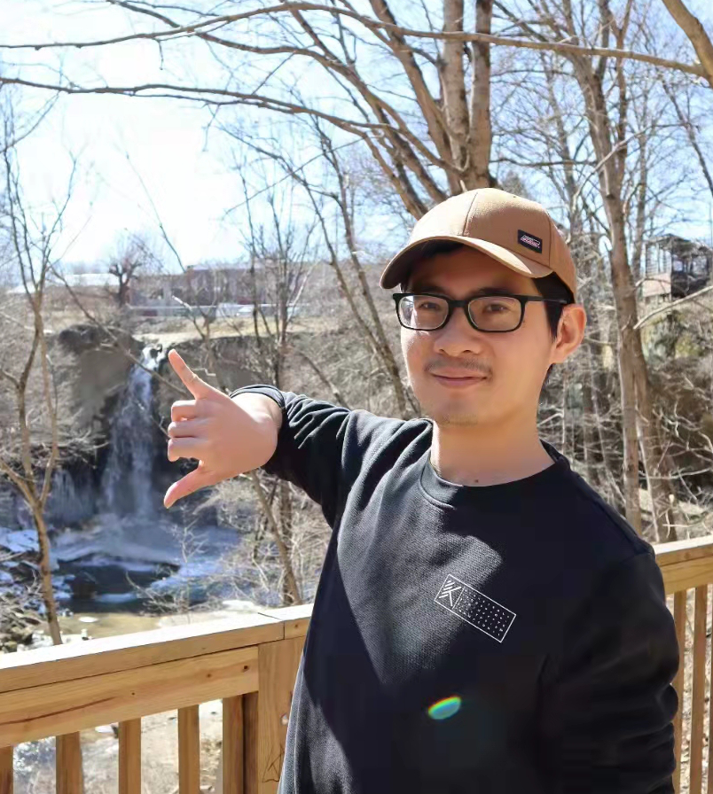
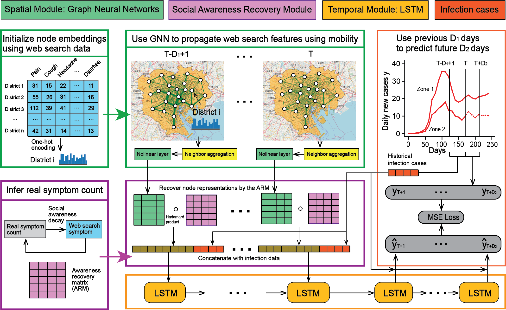
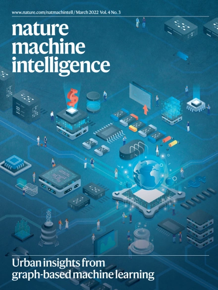
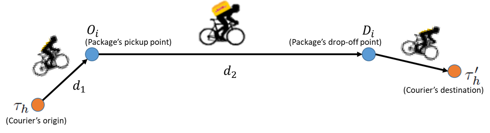
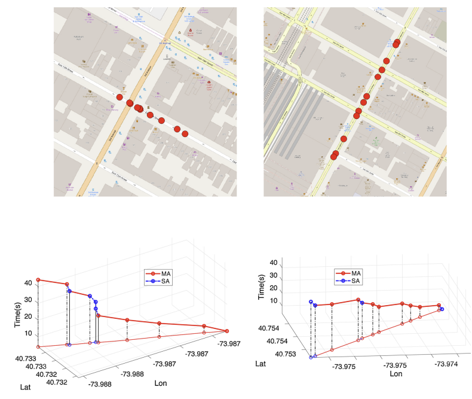
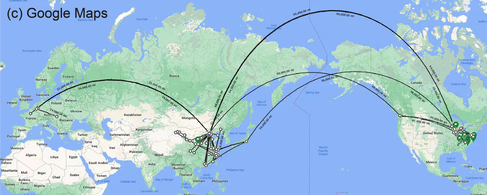

## Contact
* My photo was taken on Mar. 13, 2022, at 40.286&deg;N, 87.292&deg;W.

  

* **Location**: Lyles School of Civil Engineering, Purdue University, 550 W Stadium Ave, West Lafayette, IN 47907, U.S.
* **Phone**: (765) 714-7627.
* **Email**: xue120@purdue.edu.

## News
* [Sept. 24, 2022] Our paper [Online Eco-routing for Electric Vehicles using Combinatorial Multi-armed Bandit with Estimated Covariance](https://www.sciencedirect.com/science/article/pii/S1361920922002735?dgcid=coauthor) was online at **Transportation Research Part D: Transport and Environment**. 

* [August 17, 2022] I gave two talks titled **Artificial Intelligence in Urban Science Discovery: Graph Neural Networks** and **Optimization in Emerging Transportation Technologies: Adaptive Buses, Crowd-shipping Logistics** at Chang' An University, China.

* [July 2022] Our paper [Demand-adaptive Route Planning and Scheduling for Urban Hub-based High-capacity Mobility-on-demand Services](http://isttt24.buaa.edu.cn/List_of_Accepted_Papers.htm) was presented as a poster at the 24th International Symposium on Transportation and Traffic Theory **(ISTTT-24)**, Beijing, July 24 to 26, 2022.

* [June 20, 2022] I gave a talk titled [Harness Graph Neural Networks to Empower Urban Science Research](https://app.box.com/s/327vdk446vv2jcfi33m3nrushq58woot) (click to download the slide) at China Transportation Institute, Tongji University, China. We had a fruitful discussion and I thanked Dr. Yuntao Guo to organize the talk. 

* [May 19, 2022] Our paper [Multiwave COVID-19 Prediction from Social Awareness using Web Search and Mobility Data](https://www.kdd.org/kdd2022/paperADS.html) was accepted by the 28th ACM SIGKDD Conference on Knowledge Discovery and Data Mining **(SIGKDD-22)**. Acceptance Rate: 25.9% (195/753). **Oral Presentation.**

* [Mar. 23, 2022] Our paper [Quantifying the Spatial Homogeneity of Urban Road Networks via Graph Neural Networks](https://www.nature.com/articles/s42256-022-00462-y) was published on **Nature Machine Intelligence** (2021 IF: 25.90) and was selected as the cover paper of [Volume 4 Issue 3, March 2022](https://www.nature.com/natmachintell/volumes/4/issues/3). Besides, this paper was reported by [Nature Computational Science](https://www.nature.com/articles/s43588-022-00244-x), [Tech Xplore](https://techxplore.com/news/2022-05-graph-neural-networks-spatial-homogeneity.html), and [Peking University News](https://news.pku.edu.cn/jxky/b7c965cbb640434ca109da42c94d7e39.htm). 

* [Jan. 10, 2022] We presented [A Spatial Partitioning Algorithm of Urban Road Networks Based on Percolation Curves](https://www.researchgate.net/publication/357865214_A_Spatial_Partitioning_Algorithm_of_Urban_Road_Networks_Based_on_Percolation_Curves) at the Transportation Research Board 101st Annual Meeting in Washington, DC **(TRB-22)**.

* [Oct. 25, 2021] Our two papers [ADDS-EVS: An Agent-based Deployment Decision-support System for Electric Vehicle Services](https://ieeexplore.ieee.org/document/9564435) and [How Information Heterogeneity Influences Traffic Congestion during Hurricane Evacuation](https://ieeexplore.ieee.org/document/9564797) were presented at the 2021 IEEE Intelligent Transportation Systems Conference **(ITSC-21)**.

* [June 30, 2021] We presented [Braess’s Paradox in Scale-free Networks](https://www.youtube.com/watch?v=jdjE9pcYW2c) at the 8th International Symposium on Dynamic Traffic Assignment **(DTA-21)**. 

* [May 1, 2021] Our paper [Designing Pricing and Compensation Schemes by Integrating Matching and Routing Models for Crowd-shipping Systems](https://www.sciencedirect.com/science/article/abs/pii/S1366554520308516) was published on **Transportation Research Part E**. 

* [Oct. 27, 2020] Our paper [Online Energy-optimal Routing for Electric Vehicles with Combinatorial Multi-arm Semi-Bandit](https://ieeexplore.ieee.org/abstract/document/9294583) was presented at the 2020 IEEE Intelligent Transportation Systems Conference **(ITSC-20)**.

* [Apr. 14, 2020] I completed my **master thesis** defense titled [Structural and Dynamic Models for Complex Road Networks](https://hammer.purdue.edu/articles/thesis/Structural_and_dynamic_models_for_complex_road_networks/12245345) in Purdue University. I thank committee members: Dr. Satish V. Ukkusuri, Dr. Shreyas Sundaram, and Dr. P. Suresh C. Rao, for their guidance.

* [Jan. 28, 2020] Our paper [Impact of Transportation Network Companies on Urban Congestion: Evidence from Large-scale Trajectory Data](https://www.sciencedirect.com/science/article/abs/pii/S2210670720300408) was published on **Sustainable Cities and Society**. 

* [Oct. 27, 2019] Our paper [Stationary Spatial Charging Demand Distribution for Commercial Electric Vehicles in Urban Area](https://ieeexplore.ieee.org/abstract/document/8917359) was presented at the 2019 IEEE Intelligent Transportation Systems Conference **(ITSC-19)**.

---

## Awards
* STV Civil Engineering Grad Assistantship Endowment, Purdue University, 2019.
* Andrews Fellowship, Purdue University, 2018.
* Tsinghua’s Friend-Luo Jian First Price Scholarship, Tsinghua University, 2017.
* Meritorious Winner, Mathematical Contest In Modeling, 2017.
* The Bronze Medal in the Chinese Mathematical Olympiad (CMO), Shenyang, Liaoning, 2013.
* The First Prize in the National High School Mathematics Contest, Zhejiang, 2012.

## Selected Publications
* **Jiawei Xue**, Takahiro Yabe, Kota Tsubouchi, Jianzhu Ma, Satish V. Ukkusuri. **Multiwave COVID-19 Prediction from
Social Awareness using Web Search and Mobility Data**. Applied Data Science Track. The 28th ACM SIGKDD Conference
on Knowledge Discovery and Data Mining (SIGKDD-22), Washington DC, August 14-18, 2022.

  

* **Jiawei Xue**, Nan Jiang, Senwei Liang, Qiyuan Pang, Takahiro Yabe, Satish V. Ukkusuri, Jianzhu Ma. **Quantifying the
Spatial Homogeneity of Urban Road Networks via Graph Neural Networks**. Nature Machine Intelligence, 2022. 

  

* Tho V. Le, Satish V. Ukkusuri, **Jiawei Xue**, Tom Van Woensel. **Designing Pricing and Compensation Schemes by Integrating Matching and Routing Models for Crowd-shipping Systems.** Transportation Research Part E, 2021.

  

* Xinwu Qian, Tian Lei, **Jiawei Xue**, Zengxiang Lei, Satish V. Ukkusuri. **Impact of Transportation Network Companies on Urban Congestion: Evidence from Large-scale Trajectory Data.** Sustainable Cities and Society, 2020.

  

## Selected Coursework
- CE 597: Geospatial Modeling Analysis (A)
- CE 597: Data Science Smart Cities (A)
- CS 592: AI for Scientific Discovery (A+) 
- CS 590: Graphs in Machine Learning (A+)
- CS 593: Reinforcement Learning (A)
- CS 577: Natural Language Processing (A)
- CS 573: Data Mining (A)
- CS 590: Randomized Algorithms (A)
- CS 580: Algorithm Design Analysis and Implementation (A)
- ECE 695: Structure and Dynamics of Large-scale Networks (A+)
- MA 504: Real Analysis (A+)
- IE 538: Nonlinear Optimization (A+)
- IE 535: Linear Programming (A+)
- IE 633: Dynamic Programming (A)
- IE 690: Opt Game Theory Uncertainty (A)

## Sports 
- **1h, 48min** (2021 CNO Financial Indianapolis Monumental Half-marathon, Indianapolis, Nov. 2021).
- **1h, 51min** (2019 Boilermaker Half-marathon, West Lafayette, Oct. 2019).
- **1h, 58min** (2018 Boilermaker Half-marathon, West Lafayette, Oct. 2018).
- **2h, 36min** (2017 U-Run Tsinghua University Campus Half-marathon, Beijing, Apr. 2017).

## Mobility History
* I visualize my mobility map as of June 2022. I enjoy visiting new places, which is modeled as a Bayesian procedure. I update my belief on a place based on real-time trip observations and historical prior envisions that come from books, news, videos, friends, papers, etc.  
* I define the optimal place to live from three perspectives:
  - infrastructure accessibility (e.g., not far from airports).
  - human community development (e.g., high life expectancy).
  - environment that inspires innovation (e.g., not too bustle, and not too loose).
* Then, I conclude three optimal places: 
  - Bonn, Germany.
  - Shaoxing, China.
  - Toledo, OH, U.S.

  

<!-- 
Page template forked from <a href="https://github.com/evanca/quick-portfolio">evanca</a>
   -->  
<!-- Remove above link if you don't want to attibute -->  

